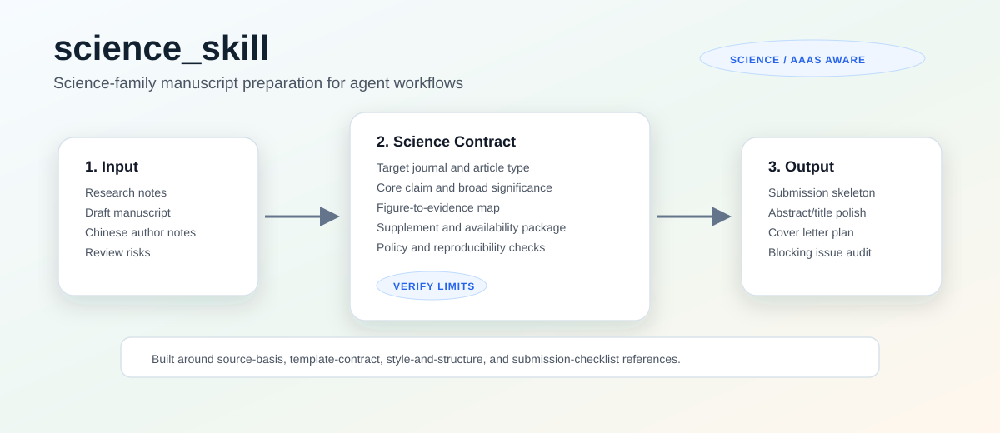
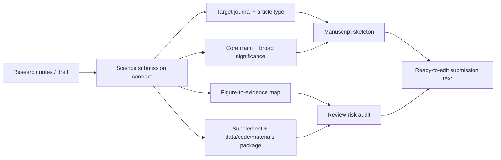
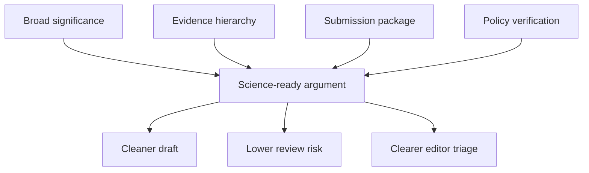

# science_skill



`science_skill` 是一个面向 **Science / AAAS 系列期刊投稿准备** 的 Agent Skill。它把零散研究笔记、中文论文草稿、图表逻辑、补充材料和数据可得性要求，整理成一个可审稿、可提交、可复核的 Science-family manuscript package。

这个仓库根目录本身就是一个可安装的 skill：`SKILL.md` 负责触发和流程控制，`references/` 保存按需加载的深层指南，`assets/` 提供可复用的投稿骨架。

## What It Does

| 能力 | 说明 |
|---|---|
| 投稿契约 | 先确定目标期刊、文章类型、核心 claim、图表证据链和补充材料边界 |
| 模板解读 | 将 Science 风格的 `Title`、`One Sentence Summary`、`Abstract`、`Main Text`、`References and Notes`、`Supplementary Materials` 等结构转成可执行写作流程 |
| 写作改稿 | 帮助标题、摘要、引言、结果、讨论、cover letter 更适合跨学科 Science 读者 |
| 合规审计 | 检查数据、代码、材料、伦理、利益冲突、作者贡献、补充材料和当前作者指南核验项 |
| 中文作者模式 | 接受中文研究笔记，输出英文投稿文本，并用中文说明缺失字段和风险 |

## Install

使用 [Vercel Labs skills CLI](https://github.com/vercel-labs/skills)：

```bash
npx skills add Chen-kaige/science_skill -g -a codex -y
```

也可以只查看仓库中的 skill：

```bash
npx skills add Chen-kaige/science_skill --list
```

安装后，在 Codex 中提出类似请求即可触发：

```text
帮我把这份中文研究笔记整理成 Science 投稿初稿，并检查补充材料和数据可得性风险。
```

## How It Works



核心原则是：**先定义投稿契约，再写正文**。这比直接润色段落更可靠，因为 Science-family 投稿首先要回答编辑会问的几个问题：这项工作为什么重要、证据链是否完整、读者是否能跨学科理解、数据和补充材料能否支撑主文 claim。

## Repository Structure

```text
science_skill/
├── SKILL.md
├── agents/
│   └── openai.yaml
├── assets/
│   ├── readme-science-skill-map.svg
│   └── science-manuscript-skeleton.md
└── references/
    ├── source-basis.md
    ├── template-contract.md
    ├── style-and-structure.md
    └── submission-checklist.md
```

## Key Files

| 文件 | 用途 |
|---|---|
| [`SKILL.md`](SKILL.md) | skill 入口；定义触发条件、工作流、中文作者模式和输出格式 |
| [`references/source-basis.md`](references/source-basis.md) | 记录官方来源、来源层级，以及哪些 Science 规则必须提交前再核验 |
| [`references/template-contract.md`](references/template-contract.md) | Science 风格稿件结构、图表证据链、补充材料和可得性契约 |
| [`references/style-and-structure.md`](references/style-and-structure.md) | 标题、摘要、one-sentence summary、正文和 cover letter 写作策略 |
| [`references/submission-checklist.md`](references/submission-checklist.md) | 最终投稿前的 blocker、主文、图表、补充材料和数据/代码检查 |
| [`assets/science-manuscript-skeleton.md`](assets/science-manuscript-skeleton.md) | 可复制改写的 Science-style manuscript skeleton |

## Example Prompts

```text
我准备投 Science Advances，下面是中文研究笔记。请先建立投稿契约，再生成英文 abstract 和 main text skeleton。
```

```text
审计这份 Science 投稿草稿，按 blocking issues、high-value revisions、ready-to-paste replacement 输出。
```

```text
帮我写 cover letter，但不要夸大结果；重点说明为什么适合 Science Robotics。
```

```text
检查我的 Supplementary Materials、Data Availability 和 Code Availability 是否支撑主文图 1-4。
```

## Source Policy

Science / AAAS 作者指南和投稿系统会更新。这个 skill 不把可变字数、图数、文章类型限制硬编码成永久事实，而是要求在最终投稿建议前核验当前目标期刊页面。

当前记录的主要来源包括：

- [Science information for authors](https://www.science.org/content/page/science-information-authors)
- [AAAS editorial policy for Science Magazine](https://www.aaas.org/publications/science-magazine/policy)
- [AAAS guide for authors from the editors at Science](https://promo.aaas.org/images/Publishing/Journals/2019/Authors%20Guide%20Brochure_Final.pdf)
- [AAAS journals page](https://www.aaas.org/journals)

如果官方页面被访问限制拦截，skill 会把相关字数、格式或系统要求标记为 `unverified`，并给出需要作者侧确认的清单。

## Design Philosophy



`science_skill` 不是普通润色 prompt。它更像一个 Science 投稿前的结构化编辑台：先把 claim、证据、图表、补充材料和合规要求对齐，再让语言服务于这个结构。
